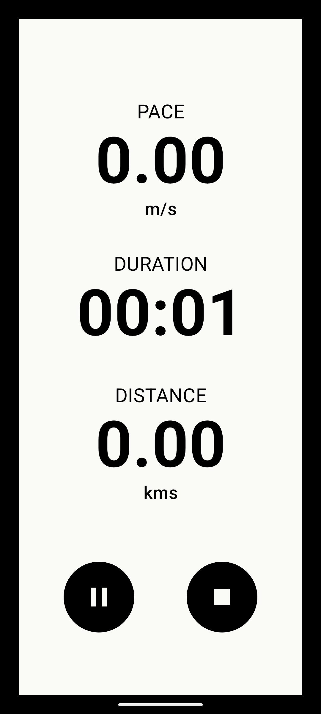
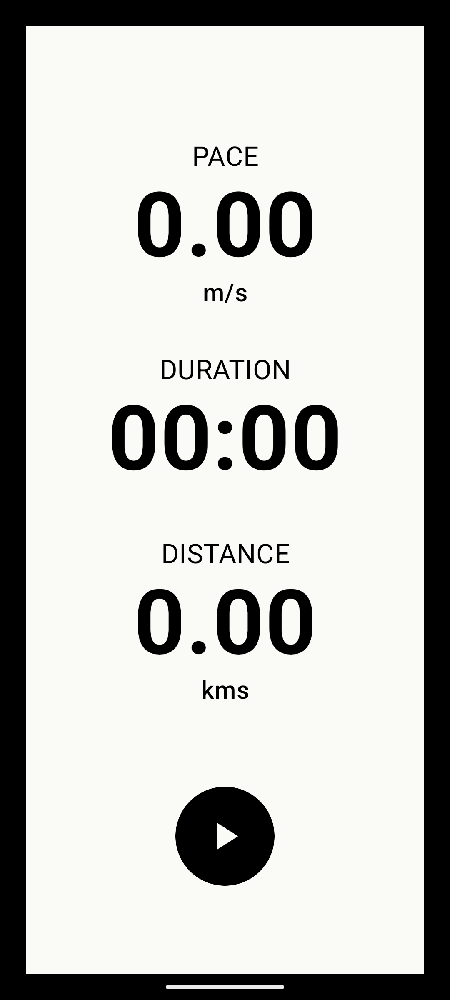

# JustRun - Running Tracker
Run, track, achieve! Your essential app for logging distance and time on every run and jog.

## Features
- **Real-time Tracking**: See your distance and time updated instantly during your activity.
- **Live Notifications**: Get key updates on your progress directly from your notification bar, so you can stay informed without interrupting your stride.

## Screenshots
<table>
  <tr>
    <td></td>
    <td></td>
    <td></td>
  </tr>
</table>

## License
MIT License. See `LICENSE` for details.